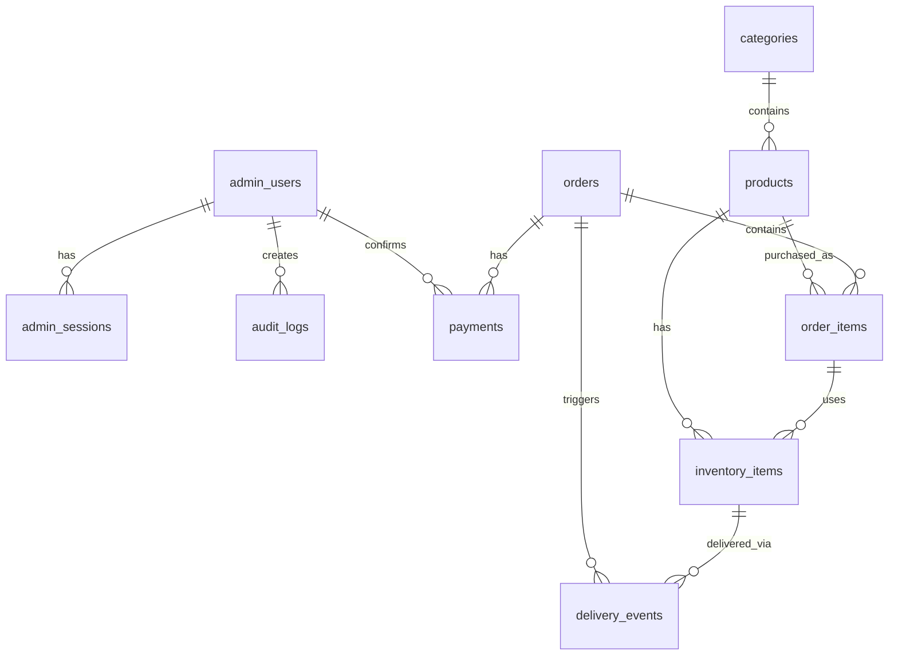

# Cấu Trúc Database - Sug4r Shop

> **Technology Stack**: Drizzle ORM + PostgreSQL
> **Schema file**: `src/db/schema.ts`

---

## 📊 Tổng Quan

Dự án có **12 bảng** được chia thành các nhóm chức năng:

---

## 🔐 Authentication & Security

### `admin_users`
| Column | Type | Description |
|--------|------|-------------|
| `id` | UUID | Primary key |
| `email` | VARCHAR(255) | Unique email |
| `password_hash` | TEXT | Hashed password |
| `totp_secret` | TEXT | 2FA secret (encrypted) |
| `totp_enabled` | BOOLEAN | 2FA status |
| `role` | VARCHAR(50) | default: "admin" |
| `is_active` | BOOLEAN | Account status |
| `last_login_at` | TIMESTAMP | Last login |
| `failed_attempts` | INTEGER | Login failures |
| `locked_until` | TIMESTAMP | Account lock time |
| `created_at` / `updated_at` | TIMESTAMP | Timestamps |

### `admin_sessions`
| Column | Type | Description |
|--------|------|-------------|
| `id` | VARCHAR(255) | Session ID (PK) |
| `user_id` | UUID | FK → admin_users |
| `expires_at` | TIMESTAMP | Session expiry |
| `ip_address` | INET | Client IP |
| `user_agent` | TEXT | Browser info |

### `security_events`
| Column | Type | Description |
|--------|------|-------------|
| `id` | UUID | Primary key |
| `event_type` | VARCHAR(100) | Event type |
| `severity` | VARCHAR(20) | info/warning/critical |
| `ip_address` | INET | Source IP |
| `target_email` | VARCHAR(255) | Target user |
| `details` | JSONB | Event details |

### `audit_logs`
| Column | Type | Description |
|--------|------|-------------|
| `id` | UUID | Primary key |
| `admin_user_id` | UUID | FK → admin_users |
| `action` | VARCHAR(100) | Action performed |
| `entity_type` | VARCHAR(50) | Target entity type |
| `entity_id` | UUID | Target entity ID |
| `details` | JSONB | Action details |

---

## 🏪 Product Catalog

### `categories`
| Column | Type | Description |
|--------|------|-------------|
| `id` | UUID | Primary key |
| `name` | VARCHAR(255) | Category name |
| `slug` | VARCHAR(255) | URL slug (unique) |
| `sort_order` | INTEGER | Display order |
| `is_active` | BOOLEAN | Active status |

### `products`
| Column | Type | Description |
|--------|------|-------------|
| `id` | UUID | Primary key |
| `category_id` | UUID | FK → categories |
| `name` | VARCHAR(255) | Product name |
| `slug` | VARCHAR(255) | URL slug (unique) |
| `description` | TEXT | Full description |
| `short_desc` | VARCHAR(500) | Short description |
| `image_url` | VARCHAR(2048) | Product image |
| `price` | INTEGER | Price in cents |
| `currency` | VARCHAR(3) | default: "USD" |
| `status` | VARCHAR(20) | draft/published |
| `sort_order` | INTEGER | Display order |
| `metadata` | JSONB | Extra data |

---

## 📦 Inventory (Digital Items)

### `inventory_items`
| Column | Type | Description |
|--------|------|-------------|
| `id` | UUID | Primary key |
| `product_id` | UUID | FK → products |
| `encrypted_payload` | BYTEA | **Encrypted digital key** |
| `encryption_iv` | BYTEA | Encryption IV |
| `encryption_tag` | BYTEA | Encryption tag |
| `encryption_key_id` | VARCHAR(50) | Key version |
| `status` | VARCHAR(20) | available/reserved/sold |
| `order_item_id` | UUID | FK → order_items |
| `reserved_at` | TIMESTAMP | Reservation time |
| `reservation_expires_at` | TIMESTAMP | Reservation expiry |
| `sold_at` | TIMESTAMP | Sale timestamp |

> **IMPORTANT**: Digital keys được mã hóa AES-256-GCM trước khi lưu vào database.

---

## 🛒 Orders & Payments

### `orders`
| Column | Type | Description |
|--------|------|-------------|
| `id` | UUID | Primary key |
| `order_code` | VARCHAR(20) | Unique order code |
| `customer_email` | VARCHAR(255) | Buyer email |
| `status` | VARCHAR(20) | pending/paid/fulfilled |
| `subtotal` / `total` | INTEGER | Amounts in cents |
| `currency` | VARCHAR(3) | Currency code |
| `ip_address` | INET | Buyer IP |
| `notes` | TEXT | Order notes |
| `fulfilled_at` | TIMESTAMP | Fulfillment time |

### `order_items`
| Column | Type | Description |
|--------|------|-------------|
| `id` | UUID | Primary key |
| `order_id` | UUID | FK → orders (CASCADE) |
| `product_id` | UUID | FK → products |
| `product_name` | VARCHAR(255) | Product snapshot |
| `quantity` | INTEGER | Quantity |
| `unit_price` / `total_price` | INTEGER | Prices in cents |

### `payments`
| Column | Type | Description |
|--------|------|-------------|
| `id` | UUID | Primary key |
| `order_id` | UUID | FK → orders (CASCADE) |
| `payment_method` | VARCHAR(50) | Payment gateway |
| `status` | VARCHAR(20) | pending/confirmed/failed |
| `amount` | INTEGER | Amount in cents |
| `provider_tx_id` | VARCHAR(255) | Gateway transaction ID |
| `provider_data` | JSONB | Gateway response |
| `confirmed_at` | TIMESTAMP | Confirmation time |
| `confirmed_by` | UUID | FK → admin_users |
| `idempotency_key` | VARCHAR(255) | Duplicate prevention |

---

## 📧 Delivery System

### `delivery_events`
| Column | Type | Description |
|--------|------|-------------|
| `id` | UUID | Primary key |
| `order_id` | UUID | FK → orders (CASCADE) |
| `inventory_item_id` | UUID | FK → inventory_items |
| `delivery_token` | VARCHAR(255) | Unique reveal token |
| `token_expires_at` | TIMESTAMP | Token expiry |
| `revealed_at` | TIMESTAMP | First reveal time |
| `revealed_ip` | INET | Reveal IP |
| `reveal_count` | INTEGER | Times revealed |
| `max_reveals` | INTEGER | Max allowed reveals |

---

## ⚙️ Settings

### `settings`
| Column | Type | Description |
|--------|------|-------------|
| `key` | VARCHAR(100) | Setting key (PK) |
| `value` | JSONB | Setting value |
| `updated_at` | TIMESTAMP | Last update |

---

## 🔗 Relationships Summary

| Parent | Child | Relationship |
|--------|-------|--------------|
| `admin_users` | `admin_sessions` | 1:N |
| `admin_users` | `audit_logs` | 1:N |
| `admin_users` | `payments` (confirmed_by) | 1:N |
| `categories` | `products` | 1:N |
| `products` | `inventory_items` | 1:N |
| `products` | `order_items` | 1:N |
| `orders` | `order_items` | 1:N (CASCADE) |
| `orders` | `payments` | 1:N (CASCADE) |
| `orders` | `delivery_events` | 1:N (CASCADE) |
| `order_items` | `inventory_items` | 1:N |
| `inventory_items` | `delivery_events` | 1:N |
